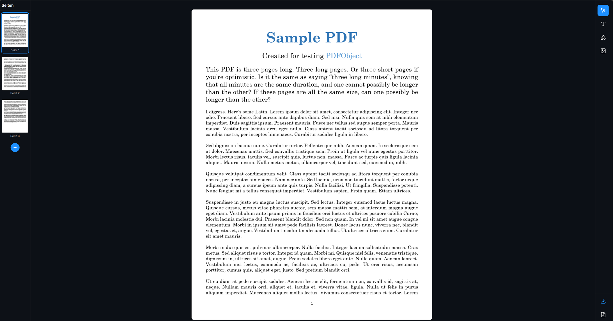

# PDF Editor

<p align="center">
  
</p>

A modern, fully client-side **PDF editor** built with Next.js and React.  
The application enables users to preview, edit, annotate, reorder, and export PDF files directly in the browser without any server-side PDF processing.

## 🔧 Tech Stack
- **Next.js (App Router)**
- **React 19**
- **TypeScript**
- **pdfjs-dist (PDF.js)** – PDF rendering on `<canvas>`
- **pdf-lib** – client-side PDF modification & export
- **Tailwind CSS v4**
- **Lucide React**

## ✨ Key Features
- PDF preview and navigation
- Text, shapes, and image annotations
- Drag, resize, rotate elements (with proportional scaling)
- Page reordering (drag & drop), rotation, deletion
- Zoom controls (`Ctrl + Scroll`)
- Light / Dark mode
- Responsive UI
- Export edited PDF with all changes applied

## 🧠 What This Project Demonstrates
- Advanced **React Hooks** usage for complex state management
- Canvas-based rendering and interaction handling
- Client-side PDF processing without backend services
- Building interactive editors with precise mouse controls
- Clean, scalable UI with modern styling tools
- Writing and validating feature-focused tests

## 🚀 Run Locally
```bash
npm install
npm run dev
```

## 📚 What I Learned From This Project

Working on this project allowed me to:
- Understand client-side PDF rendering and manipulation
- Work with canvas-based rendering using PDF.js
- Build complex interactive editors in React
- Handle advanced mouse interactions (drag, scale, rotate)
- Design a scalable state architecture using React Hooks
- Create a fully functional app without server-side file processing
- Improve UI/UX with responsive layouts and dark mode support


